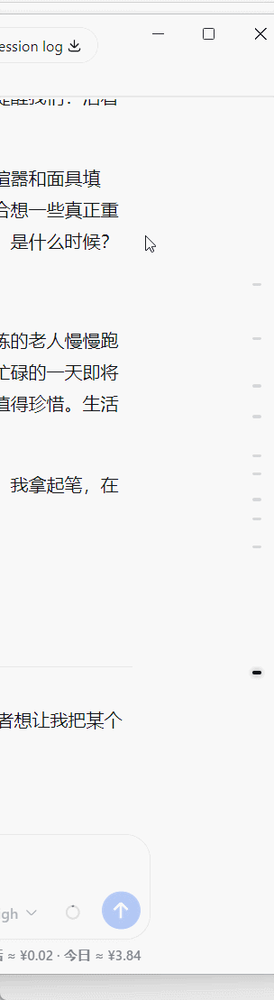
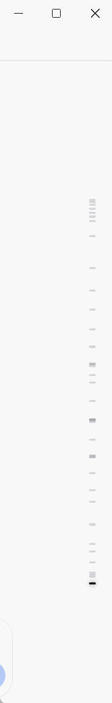

# dsh-conversation-density-map ｜ 右侧历史对话标签


  
安装：`dsh plugin --profile web add github:weien666/dsh-conversation-density-map`

<p>
  <a href="README.md">简体中文</a> | <a href="README-en.md">English</a>
</p>

一个为 **DeepSeek Harness** 打造的极简 **“对话密度地图(右侧历史对话标签)”** 插件：在聊天区右侧的固定高度内，用小刻度直观展示整段对话的 **分布** 、 **长短** 与 **当前位置**，点击任意刻度即可 **平滑跳转** 到对应对话。

纯前端、零依赖、无需构建——真正的插件本体只有 3 个源文件。


## 特性

- **一轮对话一标签**：每轮对话只占一个标签，AI 回复（含工具操作、多段文本）不会被切碎，形成 `用户 → AI → 用户 → AI` 的干净交替；
- **密度一目了然**：长回答对应更长的刻度，短消息则形成密集的短刻度，可以快速判断整段对话中哪些部分内容较多、哪些部分较碎；
- **窗口自适应布局**：
  - 常规窗口：刻度横向长度统一，保持简洁；
  - 最大化窗口：刻度横向长度会直观展示消息规模与长度；
- **悬停智能疏散**：对话较多、刻度密集时，鼠标靠近右侧标签会自动上下拉开，方便点击跳转；少量对话时悬停不移动；
- **悬停预览**：鼠标悬停任意刻度可查看预览（第几条 / 约多少字 / 内容开头）；
- **当前位置跟随**：滚动时自动高亮当前阅读的对话；
- **主题跟随**：颜色取自 Harness 现有主题变量，深浅色自动适配。

## 演示
<table width="100%">
  <tr>
    <td align="center" valign="top" width="33%">
      <b>常规窗口 vs 最大化窗口</b><br>
      右侧刻度横向长度随对话规模自动变化<br>
      （常规窗口保持等长；最大化后刻度代表对话内容长度）<br><br>
      
    </td>
    <td align="center" valign="top" width="33%">
      <b>常规窗口 · 密集对话的悬停疏散</b><br>
      对话繁多、刻度堆砌时，鼠标靠近右缘<br>
      标签自动上下拉开，便于点击跳转<br><br>
      
    </td>
    <td align="center" valign="top" width="33%">
      <b>最大化窗口 · 密集对话的悬停疏散</b><br>
      同样场景在最大化窗口下的纵向疏散效果<br><br><br>
      
    </td>
  </tr>
</table>

## 目录结构

```
dsh-conversation-density-map/
│
├── client.js          ← 插件本体：浏览器半部（对话密度地图实现）
├── index.js           ← 插件本体：宿主半部（空实现）
├── package.json       ← 插件本体：含 dsh.client / dsh.bundle 声明
├── cordis.patch.yml   ← bundle 补丁（dsh plugin 安装时自动应用，无需手动 insert）
│
├── docs/              ← 演示 GIF（仅仓库展示，安装时不会下载）
│
├── README.md
├── LICENSE
└── .gitignore
```

## 下载与安装

> DSH 静态插件是通过“把插件文件放进 DSH 的 profile + 让它注册生效”两步安装，**无需 npm install**。以下以 Windows 为例，插件本体是仓库根目录的 3 个源码文件（client.js / index.js / package.json）+ cordis.patch.yml。

### 方式 A（推荐）：一行命令安装（bundle 模式，需要 pnpm）

```bat
dsh plugin --profile web add github:weien666/dsh-conversation-density-map
```

安装会自动把插件追加进 `dsh.profile.bundles` 并应用内置补丁（cordis.patch.yml），**无需手动 insert**；只安装源码文件，**不会下载 docs 中的 GIF**。安装后重启 DSH（`dsh web restart`）并硬刷新浏览器（`Ctrl+Shift+R`）生效。

### 方式 B：从 Releases 下载插件 ZIP

1. 打开本仓库 **Releases** 页面，下载最新版 `dsh-conversation-density-map-vX.Y.Z.zip` —— **里面只有 3 个源码文件，无 GIF 杂物**；
2. 解压到任意目录，例如 `D:\plugins\dsh-conversation-density-map`（解压后含 3 个源码文件的文件夹就是“插件目录”）；
3. 在 DSH 配置目录的 `node_modules` 下创建 junction 指向它：

   ```bat
   mklink /J "C:\Users\<你的用户名>\.dsh\profiles\web\node_modules\dsh-conversation-density-map" "D:\plugins\dsh-conversation-density-map"
   ```

4. 编辑 `C:\Users\<你的用户名>\.dsh\profiles\web\cordis.patch.yml`，在末尾追加：

   ```yaml
   - insert:
       - id: conversation-density-map
         name: dsh-conversation-density-map
   ```

5. 重启 DSH（或刷新网页 `Ctrl+F5`）→ 完成。

### 方式 C：从 Code 下载整个仓库

1. GitHub 仓库页 → **Code** → **Download ZIP**（下载的是完整仓库，含源码、文档、GIF）；
2. 解压后使用**仓库根目录**的那 3 个源码文件（client.js / index.js / package.json）；
3. 同方式 B 的第 3~5 步：junction 指向该目录（或把 3 个文件直接复制到 `node_modules\dsh-conversation-density-map\`），再写注册行。

## 卸载

**方式 A（一行命令）安装的：**

```bat
dsh plugin --profile web remove dsh-conversation-density-map
```

自动移除依赖并把它从 `dsh.profile.bundles` 移除（insert 来自包内补丁，无需手动删除）。

**方式 B / C（手动安装）安装的：** 反向操作：

1. 删除 profile 的 `cordis.patch.yml` 中对应的 `insert` 两行；
2. 删除 junction（或删除 node_modules 里的文件夹）；
3. 删除解压出来的插件目录。

插件内所有效果都通过 DSH 生命周期管理，卸载后不残留任何样式或监听。

## 兼容性

- 面向 **DeepSeek Harness Web 客户端**（当前基于 `0.1.x` 的 DOM 结构：`data-chat-flow` / `data-chat-anchor-key` / `data-conversation-scroll`）；
- 不依赖任何第三方库，仅使用浏览器原生 API（IntersectionObserver / ResizeObserver / MutationObserver / DOM）；
- DSH 升级若变更聊天区 DOM 结构，可能需要小幅适配。

## 使用提示

- 点击任意刻度：平滑滚动到该对话开头；
- 鼠标靠近右侧边缘：刻度展开（悬停疏散）；
- 鼠标悬停刻度：显示内容预览。

## 协议

[MIT](LICENSE)
